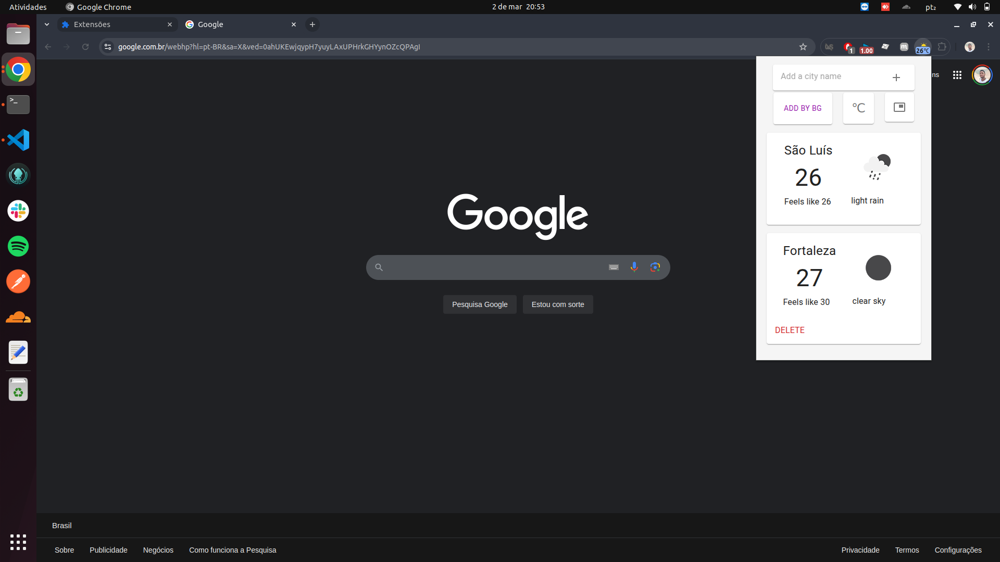

<h1 align="center">
🌤️ Weather Extension :🌤️
</h1>

<p align="center">
  

  

  <a href="https://github.com/alfredots/weather-extension/commits/main" style="text-decoration: none;">
    
  </a>

  <a href="https://github.com/alfredots/FindHouses/issues" style="text-decoration: none;">
    
  </a>

  
</p>

<p align="center">
  <a href="#-projeto">Projeto</a>&nbsp;&nbsp;&nbsp;|&nbsp;&nbsp;&nbsp;
  <a href="#rocket-requisitos">Requisitos</a>&nbsp;&nbsp;&nbsp;|&nbsp;&nbsp;&nbsp;
  <a href="#rocket-tecnologias">Tecnologias</a>&nbsp;&nbsp;&nbsp;|&nbsp;&nbsp;&nbsp;
  <a href="#rocket-aprendizado">Aprendizado</a>&nbsp;&nbsp;&nbsp;|&nbsp;&nbsp;&nbsp;
  <a href="#rocket-comandos">Comandos</a>&nbsp;&nbsp;&nbsp;|&nbsp;&nbsp;&nbsp;
  <a href="#rocket-layout">Layout</a>&nbsp;&nbsp;&nbsp;|&nbsp;&nbsp;&nbsp;
  <a href="#memo-licença">Licença</a>
</p>
<br>

## 💻 Projeto

---

Esse projeto foi desenvolvido com o objetivo de aprender a utilização do uso de Extensões Chrome com seus recursos (LocalStorage, Context Menu, Alarms), além disso, utilização de arquitetura limpa em projetos frontend. A aplicação apresentação previsão do tempo como extensão através de badge, popup e elemento flutuante.

## 💻 Features

### Popup

---


### Mudança de temperatura (Celsius - Fahrenheit)

---


### Tela de Opções

---


### Adição de cidade

---



### Elemento Flutuante (Content Script)

---


## ❗ Requisitos

---

- Você precisa instalar [Node.js](https://nodejs.org/en/download/) na versão 18 em diante.

## 🛠️ Tecnologias

---

Esse projeto foi desenvolvido com as seguintes tecnologias:

- [Vite](https://nextjs.org/)
- [Typescript](https://www.typescriptlang.org/)
- [Material UI](https://chakra-ui.com/)

\* Para mais detalhes, veja o **[Package.json](./package.json)**

## 🎓 Aprendizados

---

- Vite
- React
- Material UI
- Shadow Dom
- Chrome Extension API
- Clean Architecture

## 📃 Comandos

---

```bash
$ git clone https://github.com/alfredots/weather-extension.git && cd weather-extension
$ npm i
$ npm run dev
```

The app will be available for access on your browser at http://localhost:3000

Feito com ❤️ por Alfredo Tito </h2> [Entre em contato!](https://www.linkedin.com/in/alfredo-tito-837429ba/)
